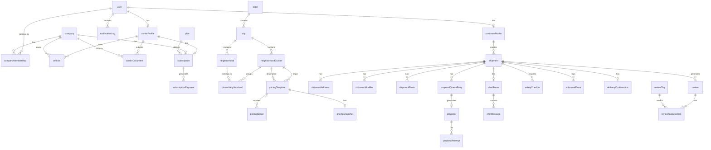

# Movux — Database Design & Domain Model

**Status:** Phase 0 — Interview-defined, pre-implementation
**Last updated:** 2026-07-14
**Owner:** David Lucas

This document is the single source of truth for the Movux data model. Every AI agent, engineer, or tool working on this codebase must read this before touching the schema.

---

## 1. Entity Hierarchy

```
User (global identity — 1 email = 1 account)
  ├── CustomerProfile        (role: CUSTOMER)
  └── CarrierProfile         (role: CARRIER)
        ├── Vehicle[]
        ├── CarrierDocument[]
        ├── Subscription (plan: FREE | PRO_*)
        └── CompanyMembership (optional — links to one Company)

Company (transportadora — CNPJ)
  ├── CompanyMembership[]    (OWNER | MANAGER | DRIVER)
  ├── Vehicle[]              (frota)
  ├── CarrierDocument[]
  └── Subscription (plan: BUSINESS | ENTERPRISE)

Shipment (core transaction)
  ├── ShipmentAddress[]      (ORIGIN + DESTINATION)
  ├── ShipmentModifier[]     (floor, helpers, etc.)
  ├── ShipmentPhoto[]
  ├── ProposalQueueEntry[]   (carriers who expressed interest)
  │     └── Proposal
  │           └── ProposalAttempt[] (up to 5 per carrier)
  ├── ChatRoom
  │     └── ChatMessage[]
  ├── SafetyCheckIn[]        (customer + carrier must confirm)
  ├── ShipmentEvent[]        (audit log)
  ├── DeliveryConfirmation
  └── Review[]               (mutual — customer↔carrier)

Geography (pricing foundation)
  State → City → NeighborhoodCluster ← Neighborhood
                         ↓
                  PricingTemplate (origin_cluster × destination_cluster × type)
                         ↓
                  PricingSnapshot (current EMA base price)
                  PricingSignal[] (immutable event log)
```

---

## 2. ER Diagram (Mermaid)



---

## 3. Entity Specifications

### 3.1 `user`

Global identity. One email = one account across the platform.

| Field | Type | Constraints | Description |
|---|---|---|---|
| `id` | uuid | PK, default uuid() | |
| `email` | varchar(255) | UNIQUE, NOT NULL | |
| `fullName` | varchar(255) | NOT NULL | |
| `passwordHash` | varchar(255) | NOT NULL | bcryptjs cost 10 |
| `role` | enum | NOT NULL | `CUSTOMER \| CARRIER \| ADMIN` |
| `emailVerifiedAt` | timestamp | nullable | null = unverified |
| `avatarUrl` | varchar(500) | nullable | |
| `createdAt` | timestamp | NOT NULL, default now() | |
| `updatedAt` | timestamp | NOT NULL, updatedAt | |
| `deletedAt` | timestamp | nullable | soft delete |

**Rules:**
- Email verification required before any action (Resend transactional email)
- Role is immutable after creation — changing role requires new account
- Soft delete: `deletedAt` set instead of row deletion; unique constraint on email excludes deleted rows

---

### 3.2 `customerProfile`

1:1 extension of `user` where `role = CUSTOMER`.

| Field | Type | Constraints | Description |
|---|---|---|---|
| `id` | uuid | PK | |
| `userId` | uuid | FK → user, UNIQUE | |
| `phone` | varchar(20) | nullable | WhatsApp-capable |
| `avgRating` | decimal(3,2) | nullable | calculated from reviews |
| `totalShipments` | int | default 0 | completed shipments count |

---

### 3.3 `carrierProfile`

1:1 extension of `user` where `role = CARRIER`.

| Field | Type | Constraints | Description |
|---|---|---|---|
| `id` | uuid | PK | |
| `userId` | uuid | FK → user, UNIQUE | |
| `cpf` | varchar(14) | UNIQUE, nullable | format: 000.000.000-00 |
| `phone` | varchar(20) | NOT NULL | |
| `bio` | text | nullable | |
| `verificationStatus` | enum | default PENDING | `PENDING \| APPROVED \| REJECTED \| SUSPENDED` |
| `verifiedAt` | timestamp | nullable | |
| `verifiedBy` | uuid | FK → user (ADMIN), nullable | |
| `avgRating` | decimal(3,2) | nullable | auto-calculated |
| `totalShipments` | int | default 0 | |
| `isActive` | boolean | default true | false = suspended |
| `currentCompanyId` | uuid | FK → company, nullable | null = autônomo |

**Rules:**
- Carrier can only propose shipments after `verificationStatus = APPROVED`
- `avgRating < 4.0` → flagged for admin review
- `avgRating < 3.5` → `isActive = false` automatically (suspended, pending admin review)
- Carrier belongs to at most one company at a time (`currentCompanyId`)
- If `currentCompanyId` is set, carrier operates under company plan

---

### 3.4 `company`

Transportadora with CNPJ — unlocks fleet management.

| Field | Type | Constraints | Description |
|---|---|---|---|
| `id` | uuid | PK | |
| `cnpj` | varchar(18) | UNIQUE, NOT NULL | format: 00.000.000/0000-00 |
| `legalName` | varchar(255) | NOT NULL | Razão social |
| `tradeName` | varchar(255) | nullable | Nome fantasia |
| `ownerId` | uuid | FK → user (CARRIER) | always the OWNER role |
| `logoUrl` | varchar(500) | nullable | |
| `verificationStatus` | enum | default PENDING | `PENDING \| APPROVED \| REJECTED` |
| `verifiedAt` | timestamp | nullable | |
| `verifiedBy` | uuid | FK → user (ADMIN), nullable | |
| `isActive` | boolean | default true | |
| `createdAt` | timestamp | default now() | |
| `updatedAt` | timestamp | updatedAt | |

---

### 3.5 `companyMembership`

Links a carrier user to a company with a role.

| Field | Type | Constraints | Description |
|---|---|---|---|
| `id` | uuid | PK | |
| `companyId` | uuid | FK → company | |
| `userId` | uuid | FK → user | |
| `role` | enum | NOT NULL | `OWNER \| MANAGER \| DRIVER` |
| `joinedAt` | timestamp | default now() | |
| `leftAt` | timestamp | nullable | null = still active |

**Constraints:**
- `UNIQUE (companyId, userId)` where `leftAt IS NULL` — carrier active in one company at a time
- `OWNER` role: exactly 1 per company (enforced at app layer)
- Leaving a company sets `leftAt` and clears `carrierProfile.currentCompanyId`

---

### 3.6 `vehicle`

Owned by a carrier (autônomo) or a company (frota).

| Field | Type | Constraints | Description |
|---|---|---|---|
| `id` | uuid | PK | |
| `ownerId` | uuid | FK → user (CARRIER), nullable | null if company vehicle |
| `companyId` | uuid | FK → company, nullable | null if personal vehicle |
| `plate` | varchar(10) | NOT NULL | Brazilian format: ABC-1234 or ABC1D23 |
| `type` | enum | NOT NULL | `MOTORCYCLE \| VAN \| TRUCK_SMALL \| TRUCK_LARGE` |
| `brand` | varchar(100) | NOT NULL | |
| `model` | varchar(100) | NOT NULL | |
| `year` | int | NOT NULL | |
| `crlvUrl` | varchar(500) | nullable | uploaded CRLV document |
| `crlvApproved` | boolean | default false | admin verified |
| `isActive` | boolean | default true | |
| `createdAt` | timestamp | default now() | |

**Rules:**
- Either `ownerId` OR `companyId` must be set, never both
- `crlvApproved = true` required for vehicle to be used in shipments

---

### 3.7 `carrierDocument`

Uploaded verification documents for carrier or company.

| Field | Type | Constraints | Description |
|---|---|---|---|
| `id` | uuid | PK | |
| `carrierId` | uuid | FK → user, nullable | null if company doc |
| `companyId` | uuid | FK → company, nullable | null if carrier doc |
| `type` | enum | NOT NULL | `CPF \| CNH_FRONT \| CNH_BACK \| ADDRESS_PROOF \| SELFIE \| CNPJ \| SOCIAL_CONTRACT` |
| `fileUrl` | varchar(500) | NOT NULL | |
| `externalValidation` | jsonb | nullable | BigDataCorp/Serpro API response |
| `status` | enum | default PENDING | `PENDING \| APPROVED \| REJECTED` |
| `reviewedBy` | uuid | FK → user (ADMIN), nullable | |
| `reviewedAt` | timestamp | nullable | |
| `rejectionReason` | text | nullable | |
| `uploadedAt` | timestamp | default now() | |

**Required docs per type:**

| Actor | Required documents |
|---|---|
| Carrier autônomo | CPF, CNH_FRONT, CNH_BACK, ADDRESS_PROOF, SELFIE |
| Company | CNPJ, SOCIAL_CONTRACT (owner's CPF+CNH via carrierDoc of owner) |
| All vehicles | CRLV (stored on `vehicle.crlvUrl`) |

---

## 4. Plans & Billing

### 4.1 `plan`

Platform-defined pricing tiers. Seeded, not user-created.

| Field | Type | Description |
|---|---|---|
| `id` | uuid | PK |
| `code` | enum | `FREE \| PRO_MONTHLY \| PRO_SEMESTER \| PRO_ANNUAL \| BUSINESS \| ENTERPRISE` |
| `name` | varchar(100) | Display name |
| `priceInCents` | int | 0 for FREE; 1490, 6990, 9990, 19900 for others |
| `billingCycle` | enum | `MONTHLY \| SEMESTER \| ANNUAL \| CUSTOM` |
| `maxActiveProposals` | int | 3 for FREE, unlimited (-1) for PRO+ |
| `maxDrivers` | int | null for non-BUSINESS; 5 for BUSINESS base |
| `extraDriverPriceInCents` | int | 2900 for BUSINESS (R$29/driver) |
| `hasAdvancedAnalytics` | boolean | false for FREE |
| `hasPriorityInSearch` | boolean | false for FREE |
| `hasVerifiedBadge` | boolean | false for FREE |
| `hasFleetManagement` | boolean | true only for BUSINESS+ |
| `hasMultiBranch` | boolean | true only for ENTERPRISE |

**Pricing table:**

| Plan | Price | Cycle | Equiv/month |
|---|---|---|---|
| FREE | R$0 | — | — |
| PRO_MONTHLY | R$14,90 | Monthly | R$14,90 |
| PRO_SEMESTER | R$69,90 | 6 months | R$11,65 |
| PRO_ANNUAL | R$99,90 | Annual | R$8,32 |
| BUSINESS | R$199,00 | Monthly | — |
| ENTERPRISE | Custom | Custom | — |

---

### 4.2 `subscription`

Active plan for a carrier or company. Managed via Mercado Pago PreApproval.

| Field | Type | Constraints | Description |
|---|---|---|---|
| `id` | uuid | PK | |
| `subscriberType` | enum | NOT NULL | `CARRIER \| COMPANY` |
| `subscriberId` | uuid | NOT NULL | FK → user or company |
| `planId` | uuid | FK → plan | |
| `status` | enum | default ACTIVE | `ACTIVE \| PAST_DUE \| CANCELLED \| TRIALING` |
| `mpPreapprovalId` | varchar(255) | nullable | Mercado Pago PreApproval ID |
| `currentPeriodStart` | timestamp | NOT NULL | |
| `currentPeriodEnd` | timestamp | NOT NULL | |
| `gracePeriodEndsAt` | timestamp | nullable | 3 days after period end before downgrade |
| `cancelledAt` | timestamp | nullable | |
| `createdAt` | timestamp | default now() | |

**Rules:**
- Non-payment → `status = PAST_DUE` → 3-day grace period → downgrade to FREE
- Cancellation is effective at `currentPeriodEnd` (no immediate cutoff)
- Only one active subscription per subscriber at a time

---

### 4.3 `subscriptionPayment`

Individual payment records from Mercado Pago webhooks.

| Field | Type | Description |
|---|---|---|
| `id` | uuid | PK |
| `subscriptionId` | uuid | FK → subscription |
| `amountInCents` | int | Actual amount charged |
| `status` | enum | `PENDING \| APPROVED \| REJECTED \| REFUNDED` |
| `mpPaymentId` | varchar(255) | Mercado Pago payment ID |
| `paidAt` | timestamp | nullable |
| `createdAt` | timestamp | |

---

## 5. Geography & Pricing Engine

### 5.1 Geographic Hierarchy

```
state (SP, PB, RJ…)
  └── city (João Pessoa, Campina Grande…)
        ├── neighborhood (Manaíra, Centro, Bancários…)
        │     classification: POPULAR | MIDDLE | UPSCALE
        └── neighborhoodCluster (Orla Norte, Centro Expandido…)
              └── clusterNeighborhood (M:N — cluster ↔ neighborhood)
```

### 5.2 `state`

| Field | Type |
|---|---|
| `id` | uuid |
| `name` | varchar(100) — e.g., "Paraíba" |
| `uf` | char(2) — e.g., "PB" |
| `ibgeCode` | varchar(7) |

### 5.3 `city`

| Field | Type |
|---|---|
| `id` | uuid |
| `stateId` | FK → state |
| `name` | varchar(100) |
| `ibgeCode` | varchar(7) |
| `isActive` | boolean — only active cities show in platform |

### 5.4 `neighborhood`

| Field | Type | Description |
|---|---|---|
| `id` | uuid | |
| `cityId` | FK → city | |
| `name` | varchar(100) | |
| `classification` | enum | `POPULAR \| MIDDLE \| UPSCALE` — set by admin, updated over time |
| `ibgeCode` | varchar(20) | nullable |

**Classification starts as admin-set, evolves based on `PricingSignal` median prices in that neighborhood.**

### 5.5 `neighborhoodCluster`

Groups of neighborhoods that share pricing (e.g., "Orla Norte" = Manaíra + Tambaú + Bessa).

| Field | Type |
|---|---|
| `id` | uuid |
| `cityId` | FK → city |
| `name` | varchar(100) |
| `slug` | varchar(100) — UNIQUE per city |

### 5.6 `clusterNeighborhood`

M:N join between cluster and neighborhood.

| Field | Type |
|---|---|
| `clusterId` | FK → neighborhoodCluster |
| `neighborhoodId` | FK → neighborhood |
| PK | `(clusterId, neighborhoodId)` |

---

### 5.7 `pricingTemplate`

Base price for a corridor: `(origin_cluster × destination_cluster × shipment_type × vehicle_type)`.

| Field | Type | Description |
|---|---|---|
| `id` | uuid | |
| `originClusterId` | FK → neighborhoodCluster | |
| `destinationClusterId` | FK → neighborhoodCluster | |
| `shipmentType` | enum | `RESIDENTIAL_MOVING \| COMMERCIAL_FREIGHT \| DELIVERY \| OTHER` |
| `vehicleType` | enum | `ANY \| MOTORCYCLE \| VAN \| TRUCK_SMALL \| TRUCK_LARGE` |
| `basePriceInCents` | int | Seed value set by admin; updated by engine |
| `isActive` | boolean | default true |
| `createdAt` | timestamp | |
| `updatedAt` | timestamp | |

**Constraint:** `UNIQUE (originClusterId, destinationClusterId, shipmentType, vehicleType)`

---

### 5.8 `pricingModifier`

Incremental factors on top of base price. Defined per city (or globally).

| Field | Type | Description |
|---|---|---|
| `id` | uuid | |
| `cityId` | FK → city, nullable | null = global modifier |
| `code` | enum | `FLOOR \| HELPER \| DISASSEMBLY \| PACKING \| DIFFICULT_ACCESS \| NIGHT_WEEKEND` |
| `name` | varchar(100) | Display name |
| `valueType` | enum | `FIXED \| PERCENTAGE` |
| `valueInCents` | int | If FIXED; or basis points if PERCENTAGE (e.g., 2000 = 20%) |
| `isActive` | boolean | |

---

### 5.9 `carrierPricingConfig`

Carrier or company's custom multiplier over platform modifiers.

| Field | Type | Description |
|---|---|---|
| `id` | uuid | |
| `carrierId` | FK → user, nullable | |
| `companyId` | FK → company, nullable | |
| `modifierCode` | enum | matches `pricingModifier.code` |
| `multiplier` | decimal(4,2) | e.g., 1.20 = +20% on this modifier |

---

### 5.10 `pricingSignal` — Immutable event log

Every pricing event is written here. Never updated, only appended.

| Field | Type | Description |
|---|---|---|
| `id` | uuid | |
| `templateId` | FK → pricingTemplate | |
| `shipmentId` | FK → shipment, nullable | |
| `signalType` | enum | `COMPLETED \| CARRIER_REJECTED \| CUSTOMER_REJECTED` |
| `priceInCents` | int | Price at signal time |
| `weight` | decimal(4,3) | Recency weight (EMA — more recent = higher weight) |
| `createdAt` | timestamp | |

**Signal semantics:**
- `COMPLETED` — shipment delivered and confirmed; price = `shipment.finalPrice`; signal: price is fair
- `CARRIER_REJECTED` — carrier refused at this price; signal: price too low for this corridor
- `CUSTOMER_REJECTED` — customer rejected all proposals; signal: price too high

---

### 5.11 `pricingSnapshot`

Current calculated base price for a template corridor. Rebuilt by the pricing engine.

| Field | Type | Description |
|---|---|---|
| `id` | uuid | |
| `templateId` | FK → pricingTemplate, UNIQUE | |
| `basePriceInCents` | int | Current EMA result |
| `sampleSize` | int | Number of signals used |
| `lastTrigger` | enum | `VOLUME \| DEVIATION \| TIME \| MANUAL` |
| `calculatedAt` | timestamp | |

**Update triggers (any one fires a recalculation):**
1. **Volume:** ≥ 10 new signals since last snapshot
2. **Deviation:** rolling average of last 10 signals deviates > 15% from current snapshot
3. **Time:** last calculation > 7 days ago (cron)
4. **Manual:** admin overrides via dashboard

**EMA formula:**
```
weight_i = α^(rank_i)    where α = 0.9 and rank_i = 0 for most recent
EMA = Σ(signal_i.price × weight_i) / Σ(weight_i)
```

---

## 6. Shipment

The core transaction of the platform.

### 6.1 `shipment`

| Field | Type | Description |
|---|---|---|
| `id` | uuid | |
| `customerId` | FK → customerProfile | |
| `status` | enum | See lifecycle below |
| `type` | enum | `RESIDENTIAL_MOVING \| COMMERCIAL_FREIGHT \| DELIVERY \| OTHER` |
| `description` | text | Free-text description of items |
| `estimatedWeightKg` | decimal(8,2) | nullable |
| `estimatedVolumeM3` | decimal(8,2) | nullable |
| `vehicleTypeRequired` | enum | `ANY \| MOTORCYCLE \| VAN \| TRUCK_SMALL \| TRUCK_LARGE` |
| `scheduledDate` | date | NOT NULL |
| `timeWindow` | enum | `MORNING \| AFTERNOON \| EVENING \| SPECIFIC` |
| `specificTime` | time | nullable — only if timeWindow = SPECIFIC |
| `suggestedPriceInCents` | int | Calculated from pricingTemplate + modifiers |
| `finalPriceInCents` | int | nullable — set when carrier accepted |
| `etaMinutes` | int | nullable — Google Maps Distance Matrix |
| `windowExpiresAt` | timestamp | nullable — ETA + 30min buffer; alert if exceeded |
| `customerSlaHours` | int | SLA chosen by customer (4\|6\|8\|12\|24) |
| `collectedAt` | timestamp | nullable — set when carrier marks COLLECTED |
| `inTransitAt` | timestamp | nullable — set when carrier marks IN_TRANSIT |
| `deliveredAt` | timestamp | nullable — set when carrier marks DELIVERED; source of the 24h auto-confirm deadline (§9.3) |
| `expiresAt` | timestamp | nullable — shipment auto-expires if no carrier selected |
| `cancelledAt` | timestamp | nullable |
| `cancelReason` | text | nullable |
| `createdAt` | timestamp | |
| `updatedAt` | timestamp | |

**Lifecycle:**
```
DRAFT
  ↓ customer publishes
OPEN
  ↓ carriers join queue → groups of 3 called simultaneously
PROPOSALS_RECEIVED
  ↓ customer accepts a proposal
CARRIER_SELECTED
  ↓ both parties confirm safety term (safetyCheckIn)
  ↓ carrier marks collected
COLLECTED
  ↓ carrier marks in transit
IN_TRANSIT
  ↓ carrier marks delivered
  ↓ customer double-confirms (deliveryConfirmation)
DELIVERED
  ↓ both leave reviews
REVIEWED
  ── or ──
CANCELLED (from DRAFT, OPEN, PROPOSALS_RECEIVED, CARRIER_SELECTED)
EXPIRED (from OPEN — no carrier selected within window)
```

---

### 6.2 `shipmentAddress`

Origin and destination for a shipment.

| Field | Type | Description |
|---|---|---|
| `id` | uuid | |
| `shipmentId` | FK → shipment | |
| `type` | enum | `ORIGIN \| DESTINATION` |
| `street` | varchar(255) | |
| `number` | varchar(20) | |
| `complement` | varchar(100) | nullable |
| `neighborhoodId` | FK → neighborhood | nullable — used for pricing |
| `neighborhoodName` | varchar(100) | stored for display even if no FK match |
| `cityId` | FK → city | |
| `state` | char(2) | |
| `zipCode` | varchar(9) | |
| `lat` | decimal(10,8) | nullable — from Google Maps geocode |
| `lng` | decimal(11,8) | nullable | |
| `floor` | int | nullable — for apartment/building |
| `hasElevator` | boolean | nullable |

**Constraint:** `UNIQUE (shipmentId, type)` — one origin, one destination per shipment

---

### 6.3 `shipmentModifier`

Selected modifiers for this specific shipment.

| Field | Type | Description |
|---|---|---|
| `id` | uuid | |
| `shipmentId` | FK → shipment | |
| `modifierCode` | enum | matches `pricingModifier.code` |
| `quantity` | int | default 1 (e.g., 2 helpers) |
| `appliedValueInCents` | int | snapshot of value at time of shipment creation |

---

### 6.4 `shipmentPhoto`

Photos uploaded by customer to describe items.

| Field | Type |
|---|---|
| `id` | uuid |
| `shipmentId` | FK → shipment |
| `url` | varchar(500) |
| `uploadedAt` | timestamp |

---

## 7. Proposals & Queue

### 7.1 `proposalQueueEntry`

Tracks carriers who expressed interest in a shipment (the queue).

| Field | Type | Description |
|---|---|---|
| `id` | uuid | |
| `shipmentId` | FK → shipment | |
| `carrierId` | FK → user (CARRIER) | |
| `status` | enum | `WAITING \| CALLED \| ACTIVE \| EXHAUSTED \| WITHDRAWN` |
| `position` | int | Queue position (FIFO) |
| `calledAt` | timestamp | nullable — when system called this carrier |
| `exhaustedAt` | timestamp | nullable — when all 5 attempts used |
| `createdAt` | timestamp | |

**Constraint:** `UNIQUE (shipmentId, carrierId)`

**Queue mechanics:**
- Carriers join as `WAITING`
- System calls groups of 3 simultaneously (`status → CALLED`)
- If carrier sends a proposal → `ACTIVE`
- If carrier's last attempt rejected by customer → `EXHAUSTED`
- Carrier withdraws → `WITHDRAWN`
- Next group called when all CALLED carriers are EXHAUSTED or WITHDRAWN

---

### 7.2 `proposal`

One carrier's negotiation on one shipment.

| Field | Type | Description |
|---|---|---|
| `id` | uuid | |
| `shipmentId` | FK → shipment | |
| `carrierId` | FK → user (CARRIER) | |
| `queueEntryId` | FK → proposalQueueEntry | |
| `status` | enum | `ACTIVE \| ACCEPTED \| REJECTED \| WITHDRAWN \| EXPIRED` |
| `currentAttempt` | int | 1–5 |
| `customerSlaHours` | int | SLA chosen by customer |
| `carrierSlaHours` | int | SLA chosen by carrier |
| `agreedSlaHours` | int | `(customerSlaHours + carrierSlaHours) / 2` — rounded up |
| `expiresAt` | timestamp | `createdAt + agreedSlaHours` |
| `createdAt` | timestamp | |
| `updatedAt` | timestamp | |

**Rules:**
- `UNIQUE (shipmentId, carrierId)` — one proposal per carrier per shipment
- Max 5 attempts (`currentAttempt ≤ 5`); after 5th attempt rejected → `status = REJECTED`, queue entry `EXHAUSTED`
- SLA: always the average (rounded up) between both parties' chosen hours
- `expiresAt` recalculated on each new attempt

---

### 7.3 `proposalAttempt`

Each individual attempt within a proposal (up to 5).

| Field | Type | Description |
|---|---|---|
| `id` | uuid | |
| `proposalId` | FK → proposal | |
| `attemptNumber` | int | 1–5 |
| `priceInCents` | int | Carrier's proposed price |
| `message` | text | nullable — optional message to customer |
| `proposedAt` | timestamp | |
| `respondedAt` | timestamp | nullable |
| `responseType` | enum | `PENDING \| ACCEPTED \| REJECTED` |

---

## 8. Chat

### 8.1 `chatRoom`

One room per shipment. Created when first proposal is submitted.

| Field | Type |
|---|---|
| `id` | uuid |
| `shipmentId` | FK → shipment, UNIQUE |
| `createdAt` | timestamp |

### 8.2 `chatMessage`

Real-time messages via WebSocket (Socket.io or Ably).

| Field | Type | Description |
|---|---|---|
| `id` | uuid | |
| `roomId` | FK → chatRoom | |
| `senderId` | FK → user | |
| `content` | text | NOT NULL |
| `sentAt` | timestamp | |
| `readAt` | timestamp | nullable — null = unread |

---

## 9. Safety & Transit

### 9.1 `safetyCheckIn`

Records that both customer and carrier confirmed the safety disclaimer before transit.

| Field | Type | Description |
|---|---|---|
| `id` | uuid | |
| `shipmentId` | FK → shipment | |
| `userId` | FK → user | |
| `role` | enum | `CUSTOMER \| CARRIER` |
| `confirmedAt` | timestamp | |
| `ipAddress` | inet | nullable — legal record |

**Constraint:** `UNIQUE (shipmentId, role)` — one confirmation per role per shipment
**Rule:** Shipment cannot transition to `COLLECTED` until both roles have confirmed.

---

### 9.2 `shipmentEvent`

Immutable audit log of all events on a shipment.

| Field | Type | Description |
|---|---|---|
| `id` | uuid | |
| `shipmentId` | FK → shipment | |
| `eventType` | enum | `PUBLISHED \| CARRIER_CALLED \| PROPOSAL_RECEIVED \| CARRIER_SELECTED \| SAFETY_CONFIRMED \| COLLECTED \| IN_TRANSIT \| DELIVERED \| WINDOW_ALERT \| CANCELLED \| EXPIRED` |
| `triggeredBy` | uuid | FK → user, nullable (system events = null) |
| `occurredAt` | timestamp | |
| `metadata` | jsonb | nullable — e.g., `{ "alertType": "eta_exceeded" }` |

---

### 9.3 `deliveryConfirmation`

Customer's double-confirmation of delivery (Uber-style).

| Field | Type | Description |
|---|---|---|
| `id` | uuid | |
| `shipmentId` | FK → shipment, UNIQUE | |
| `customerId` | FK → customerProfile | |
| `confirmed` | boolean | true = delivered OK; false = issue reported |
| `issueDescription` | text | nullable — if confirmed = false |
| `confirmedAt` | timestamp | |

**Rule:** If customer does not respond within 24h of carrier marking `DELIVERED`, system auto-confirms and logs a `SHIPMENT_EVENT` of type `DELIVERED` with `triggeredBy = null`.

---

## 10. Reviews

### 10.1 `review`

Mutual rating system — both customer and carrier review each other.

| Field | Type | Description |
|---|---|---|
| `id` | uuid | |
| `shipmentId` | FK → shipment | |
| `reviewerId` | FK → user | who wrote the review |
| `revieweeId` | FK → user | who was reviewed |
| `reviewerRole` | enum | `CUSTOMER \| CARRIER` |
| `rating` | int | CHECK (rating BETWEEN 1 AND 5) |
| `createdAt` | timestamp | |

**Constraints:**
- `UNIQUE (shipmentId, reviewerRole)` — one review per role per shipment
- Reviews only allowed when `shipment.status = REVIEWED`
- No text comments in v1 — tags only

---

### 10.2 `reviewTag`

Predefined chips for both review directions.

| Field | Type | Description |
|---|---|---|
| `id` | uuid | |
| `code` | varchar(50) | UNIQUE — e.g., `CAREFUL_WITH_ITEMS` |
| `label` | varchar(100) | PT-BR display — e.g., "Cuidadoso com os itens" |
| `targetRole` | enum | `CARRIER \| CUSTOMER` — which side this tag applies to |
| `isActive` | boolean | |

**Seeded carrier tags:** `CAREFUL_WITH_ITEMS`, `PUNCTUAL`, `COMMUNICATIVE`, `CLEAN_VEHICLE`, `PROFESSIONAL`

**Seeded customer tags:** `PUNCTUAL`, `CLEAR_DESCRIPTION`, `EASY_ACCESS`, `RESPECTFUL`, `ITEMS_READY`

### 10.3 `reviewTagSelection`

Join between review and selected tags.

| Field | Type |
|---|---|
| `reviewId` | FK → review |
| `tagId` | FK → reviewTag |
| PK | `(reviewId, tagId)` |

---

## 11. Notifications

### 11.1 `notificationLog`

Record of every notification sent (email or WhatsApp).

| Field | Type | Description |
|---|---|---|
| `id` | uuid | |
| `userId` | FK → user | |
| `channel` | enum | `EMAIL \| WHATSAPP` |
| `templateCode` | varchar(100) | e.g., `PROPOSAL_RECEIVED`, `SLA_EXPIRING` |
| `status` | enum | `PENDING \| SENT \| FAILED` |
| `providerMessageId` | varchar(255) | nullable — Resend/Meta message ID |
| `metadata` | jsonb | nullable — `{ "shipmentId": "...", "proposalId": "..." }` |
| `sentAt` | timestamp | nullable |
| `createdAt` | timestamp | |

**Notification events and channels:**

| Event | Email | WhatsApp |
|---|---|---|
| Email verification | ✅ | — |
| Carrier called for shipment | ✅ | ✅ |
| Proposal received | ✅ | ✅ |
| Proposal accepted | ✅ | ✅ |
| SLA expiring (1h before) | ✅ | ✅ |
| Carrier selected | ✅ | ✅ |
| Safety term required | ✅ | ✅ |
| Shipment collected | — | ✅ |
| ETA window alert | ✅ | ✅ |
| Delivery confirmation request | ✅ | ✅ |
| Review reminder | ✅ | — |
| Subscription payment reminder | ✅ | — |
| Document approved/rejected | ✅ | ✅ |

---

## 12. Business Rules Summary

### Carrier rules
- Cannot propose until `verificationStatus = APPROVED` and at least one `vehicle` with `crlvApproved = true`
- Max `plan.maxActiveProposals` simultaneous active proposals (3 for FREE)
- One proposal per shipment; up to 5 attempts
- Belongs to at most one company at a time
- `avgRating < 4.0` → admin flag; `avgRating < 3.5` → auto-suspend

### Shipment rules
- Must have exactly 1 ORIGIN and 1 DESTINATION address
- `suggestedPrice` = `pricingSnapshot.basePrice` + Σ(`shipmentModifier.appliedValue × carrierMultiplier`)
- Cannot transition from CARRIER_SELECTED to COLLECTED until both `safetyCheckIn` records exist
- Auto-expires if no carrier selected within `expiresAt`
- Cancellation only allowed before `COLLECTED`

### Proposal rules
- SLA = `ceil((customerSlaHours + carrierSlaHours) / 2)`
- Expired proposal (past `expiresAt` without response) → `status = EXPIRED`; carrier's queue entry → next attempt or EXHAUSTED
- After 5th rejected attempt → queue entry `EXHAUSTED`; next group of 3 called

### Pricing engine rules
- `pricingSignal` is append-only — never updated or deleted
- Snapshot recalculation triggered by any of: volume (≥10 signals), deviation (>15%), time (>7 days), or manual admin
- EMA decay factor α = 0.9 (most recent signal has full weight, each older signal decays by 10%)
- Rejection signals (CARRIER_REJECTED / CUSTOMER_REJECTED) invert the signal direction in the EMA

### Review rules
- Both customer and carrier must review independently
- Reviews only enabled after `shipment.status = DELIVERED` confirmed
- Tags must match `targetRole` (carrier tags on carrier-targeted reviews only)
- `avgRating` on `carrierProfile` and `customerProfile` recalculated after every new review

---

## 13. Key Database Indexes

```sql
-- User lookups
CREATE UNIQUE INDEX ON "user" (email) WHERE "deletedAt" IS NULL;

-- Carrier verification queue (admin panel)
CREATE INDEX ON "carrierProfile" ("verificationStatus") WHERE "verificationStatus" = 'PENDING';

-- Active shipments by customer
CREATE INDEX ON "shipment" ("customerId", "status");

-- Open shipments for carrier browsing
CREATE INDEX ON "shipment" ("status", "scheduledDate") WHERE "status" = 'OPEN';

-- Pricing corridor lookup (hot path)
CREATE UNIQUE INDEX ON "pricingTemplate" ("originClusterId", "destinationClusterId", "shipmentType", "vehicleType");
CREATE INDEX ON "pricingSignal" ("templateId", "createdAt" DESC);

-- Proposal queue ordering
CREATE INDEX ON "proposalQueueEntry" ("shipmentId", "position") WHERE "status" = 'WAITING';

-- Carrier proposals (plan limit check)
CREATE INDEX ON "proposal" ("carrierId", "status") WHERE "status" = 'ACTIVE';

-- Chat messages (real-time read)
CREATE INDEX ON "chatMessage" ("roomId", "sentAt" DESC);

-- Notification delivery status
CREATE INDEX ON "notificationLog" ("userId", "status", "createdAt" DESC);

-- Subscription status (billing jobs)
CREATE INDEX ON "subscription" ("status", "currentPeriodEnd") WHERE "status" IN ('ACTIVE', 'PAST_DUE');
```

---

## 14. Prisma Naming Convention

Following Turnora's established convention:

| Layer | Convention | Example |
|---|---|---|
| Prisma model name | `PascalCase` singular | `model ShipmentAddress` |
| Prisma field name | `camelCase` | `originClusterId` |
| DB table name | `camelCase` singular (via `@@map`) | `@@map("shipmentAddress")` |
| DB column name | `snake_case` (via `@map`) | `@map("origin_cluster_id")` |
| Enum values | `UPPER_SNAKE_CASE` | `RESIDENTIAL_MOVING` |

---

## 15. External Integrations

| Service | Purpose | When |
|---|---|---|
| **Resend** | Transactional email | All phases |
| **Meta WhatsApp Cloud API** | WhatsApp notifications | MVP (free tier: 1k/month) |
| **Mercado Pago** | Subscription billing (PreApproval) | Plans |
| **BigDataCorp** | CPF/CNH/plate validation API | Document verification |
| **Serpro DataValid** | CNPJ + habilitação verification | Company + CNH |
| **Google Maps Distance Matrix** | ETA calculation for shipments | IN_TRANSIT |
| **Google Maps Geocoding** | Lat/lng from address | Shipment creation |

---

*This document must be updated whenever the schema changes. No migration should be written without first updating this file.*
